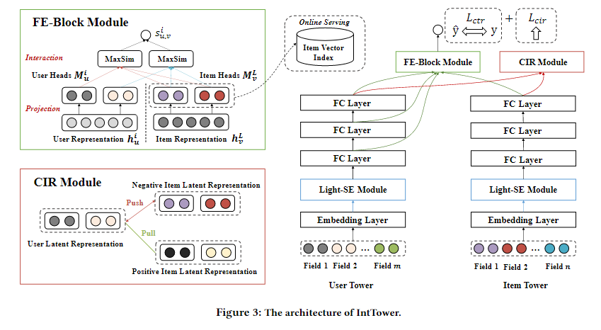
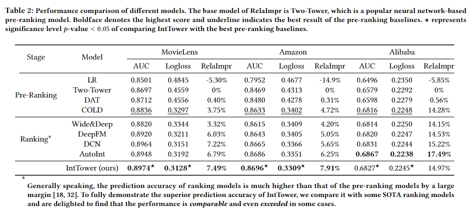

# Description
Official Pytorch Version code of CIKM 2022 Paper ["IntTower: the Next Generation of  Two-Tower Model for Pre-ranking System"](https://arxiv.org/abs/2210.09890)

[Other Mindspore Version](https://gitee.com/mindspore/models/tree/master/research/recommend/IntTower)

Accept by CIKM 2022 and [DLP-KDD 2022 workshop best paper](https://dlp-kdd2022.github.io/)
## Easy to use
``` shell
pip install -r requirements.txt
python train_movielens_IntTower.py 
```
## Source code of Paper "IntTower: the Next Generation of  Two-Tower Model for Pre-ranking System" 

# Contents
- [Contents](#contents)
- [IntTower Description](#IntTower-description)
- [Dataset](#dataset)
- [Environment Requirements](#environment-requirements)
- [Quick Start](#quick-start)
- [Performance](#performance)

# [IntTower Description](#contents)

The proposed model, IntTower (short for Interaction enhanced Two-Tower), consists of Light-SE, FE-Block and CIR modules. 
Specifically, lightweight Light-SE module is used to identify the importance of different features and obtain refined feature representations in each tower. FE-Block module performs fine-grained and early feature interactions to capture the interactive signals between user and item towers explicitly and CIR module leverages a contrastive interaction regularization to further enhance the interactions implicitly.

[Paper](https://dl.acm.org/doi/abs/10.1145/3459637.3481915): Xiangyang Li*, Bo Chen*, Huifeng Guo, Jingjie Li, Chenxu Zhu, Xiang Long, Yichao Wang, Wei Guo, Longxia Mao, Jinxing Liu, Zhenhua Dong, Ruiming Tang. [IntTower: the Next Generation of Two-Tower Model for
Pre-Ranking System](https://arxiv.org/abs/2210.09890)

- Light-SE Module

  ```python
  class LightSE(nn.Module):
    """LightSELayer used in IntTower.
      Input shape
        - A list of 3D tensor with shape: ``(batch_size,filed_size,embedding_size)``.
      Output shape
        - A list of 3D tensor with shape: ``(batch_size,filed_size,embedding_size)``.
      Arguments
        - **filed_size** : Positive integer, number of feature groups.
      """
  
    def __init__(self, field_size, embedding_size=32):
        super(LightSE, self).__init__()
        self.softmax = nn.Softmax(dim=1)
        self.field_size = field_size
        self.embedding_size = embedding_size
        self.excitation = nn.Sequential(
            nn.Linear(self.field_size, self.field_size)
        )
  
    def forward(self, inputs):
        if len(inputs.shape) != 3:
            raise ValueError(
                "Unexpected inputs dimensions %d, expect to be 3 dimensions" % (len(inputs.shape)))
        Z = torch.mean(inputs, dim=-1, out=None)
        A = self.excitation(Z) #(batch,reduction_size)
        A = self.softmax(A) #(batch,reduction_size)
        out = inputs * torch.unsqueeze(A, dim=2)
        return inputs + out

    ```
  - FE Score
    
    ```python
    def fe_score(user_rep, item_rep, user_fea_col, item_fea_col, user_embedding_dim, item_embedding_dim):
      score = []
      for i in range(len(user_embedding_dim)):
        user_temp = torch.reshape(user_rep[i], (-1, user_fea_col, user_embedding_dim[i]))
        item_temp = torch.reshape(item_rep[-1], (-1, item_fea_col, item_embedding_dim[i]))
        score.append((user_temp @ item_temp.permute(0, 2, 1)).max(2).values.sum(1))
      score = torch.stack(score).transpose(1, 0)
      return torch.sum(score, 1)
    ```
  

# [Dataset](#contents)

- [Movie-Lens-1M](https://grouplens.org/datasets/movielens/1m/)
- [Amazon(electronic)](https://jmcauley.ucsd.edu/data/amazon/)
- [Alibaba ads](https://tianchi.aliyun.com/dataset/dataDetail?dataId=56)

# [Environment Requirements](#contents)

- Hardware（CPU/GPU）
    - Prepare hardware environment with CPU or GPU processor.
- Framework
- Requirements
  - deepctr==0.9.0
  - deepctr_torch==0.2.7
  - deepmatch==0.2.0
  - keras==2.8.0
  - matplotlib==3.5.2
  - numpy==1.21.4
  - pandas==1.4.2
  - pytorch_lightning==1.6.3
  - scikit_learn==1.1.1
  - tensorflow==2.8.0
  - torch==1.10.0
  - torchkeras==3.0.2
  - torchsummary==1.5.1
  - torchvision==0.12.0
  - tqdm==4.51.0
  - xgboost==1.6.1


# [Quick Start](#contents)


- running on CPU or GPU

  ```python
  # run training and evaluation example
  pip install -r requirements.txt
  python train_movielens_IntTower.py
  ```
- Compare with other model 

  We supply 8 models to compare inttower, you can change your model such as:

  ```python

  from model.dcn import DCN
  model = DCN(linear_feature_columns, dnn_feature_columns, task='binary', dnn_dropout=dropout,
                    device=device)
  ```  

- Accelerate

  For online inference , you can only use the last layer FE-Module to compute MaxSim Score.
  
  Just change preprocessing/utils.py fe_score function
  
  ```python
  
  def fe_score(user_rep, item_rep, user_fea_col, item_fea_col, user_embedding_dim, item_embedding_dim):
    user_embedding, item_embedding  = user_rep[0],item_rep[0]
    user_rep = torch.reshape(user_embedding, (-1, user_fea_col, user_embedding_dim[0]))
    item_rep = torch.reshape(item_embedding, (-1, item_fea_col, item_embedding_dim[0]))
    
    return (user_rep @ item_rep.permute(0, 2, 1)).max(2).values.sum(1)
  ```
  
  
  
 # [Performance](#contents)
 

## cite our work
```
@inproceedings{10.1145/3511808.3557072,
author = {Li, Xiangyang and Chen, Bo and Guo, Huifeng and Li, Jingjie and Zhu, Chenxu and Long, Xiang and Li, Sujian and Wang, Yichao and Guo, Wei and Mao, Longxia and Liu, Jinxing and Dong, Zhenhua and Tang, Ruiming},
title = {IntTower: The Next Generation of Two-Tower Model for Pre-Ranking System},
year = {2022},
isbn = {9781450392365},
publisher = {Association for Computing Machinery},
address = {New York, NY, USA},
url = {https://doi.org/10.1145/3511808.3557072},
doi = {10.1145/3511808.3557072},
abstract = {Scoring a large number of candidates precisely in several milliseconds is vital for industrial pre-ranking systems. Existing pre-ranking systems primarily adopt the two-tower model since the "user-item decoupling architecture" paradigm is able to balance the efficiency and effectiveness. However, the cost of high efficiency is the neglect of the potential information interaction between user and item towers, hindering the prediction accuracy critically. In this paper, we show it is possible to design a two-tower model that emphasizes both information interactions and inference efficiency. The proposed model, IntTower (short for Interaction enhanced Two-Tower), consists of Light-SE, FE-Block and CIR modules. Specifically, lightweight Light-SE module is used to identify the importance of different features and obtain refined feature representations in each tower. FE-Block module performs fine-grained and early feature interactions to capture the interactive signals between user and item towers explicitly and CIR module leverages a contrastive interaction regularization to further enhance the interactions implicitly. Experimental results on three public datasets show that IntTower outperforms the SOTA pre-ranking models significantly and even achieves comparable performance in comparison with the ranking models. Moreover, we further verify the effectiveness of IntTower on a large-scale advertisement pre-ranking system. The code of IntTower is publicly available https://gitee.com/mindspore/models/tree/master/research/recommend/IntTower.},
booktitle = {Proceedings of the 31st ACM International Conference on Information &amp; Knowledge Management},
pages = {3292–3301},
numpages = {10},
keywords = {pre-ranking system, recommender systems, neural networks},
location = {Atlanta, GA, USA},
series = {CIKM '22}
}
```

